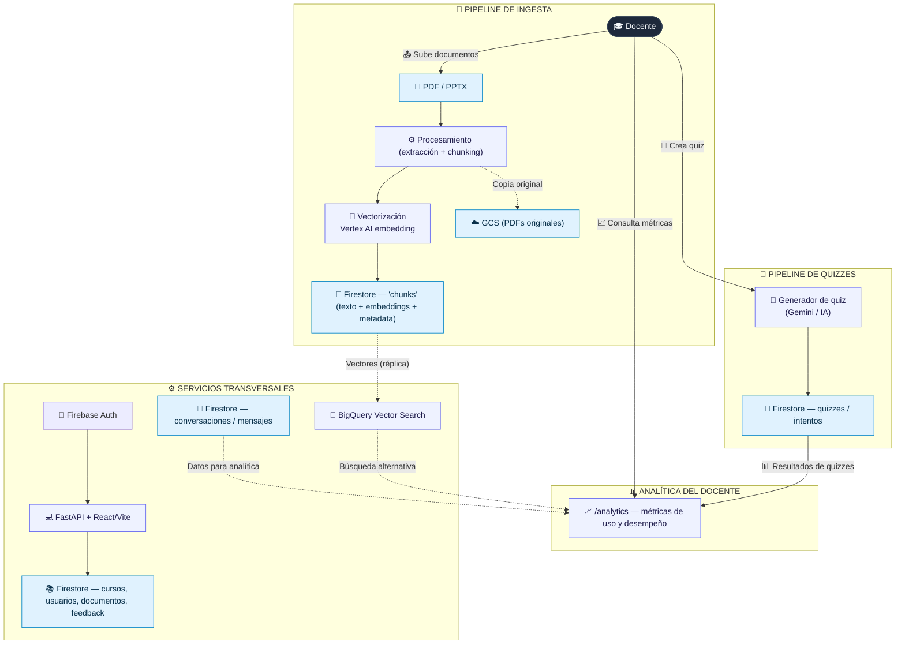
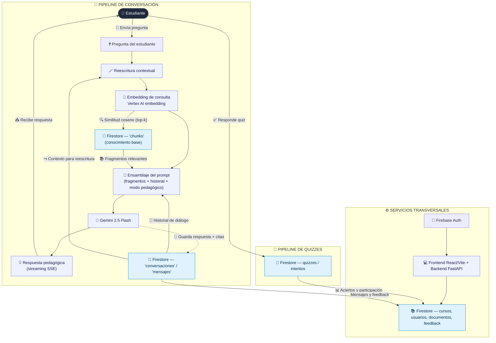

## Arquitectura del Proyecto

## Docente

Sube documentos (dispara ingesta), crea quizzes, consulta analítica del curso

## Estudiante 

Conversa con el tutor RAG (modo Directo o Socrático), responde quizzes

## Notas de fidelidad al código

### Pipeline de ingesta
- Soporta **PDF** (`pypdf`) y **PPTX** (`python-pptx`) — [documentos.py](../backend/app/routers/documentos.py).
- Chunking por páginas; cada chunk guarda `texto + embedding + nombre_doc + pagina + curso_id`.
- Backend de recuperación configurable: `firestore_scan` (default, coseno en Python) o `bigquery_vector` — `settings.rag_backend`.

### Pipeline de conversación
- **Paso 3 — Reescritura de consulta** ⭐ nuevo: `reescribir_consulta()` en [gemini.py](../backend/app/core/gemini.py).
  - Se omite si el mensaje ya tiene ≥6 palabras y no contiene términos vagos (`_necesita_reescritura`).
  - Se omite si no hay historial (primer mensaje de la conversación).
- **Flag `rendicion`**: activo cuando el estudiante dice "no lo sé" / "ayúdame" en modo socrático → obliga síntesis final.
- **Flag `contexto_debil`**: activo cuando el mejor score RAG < `rag_score_confianza` (0.6) → avisa al modelo que el contexto es parcial.
- **Fallback de chunks**: si la búsqueda devuelve vacío en una conversación existente, se reutilizan los `chunks_usados` del turno anterior.
- **Grounding check**: si la respuesta no contiene `[📄…]` con chunks sólidos disponibles, se reintenta con instrucción explícita de citar.
- **Robustez streaming**: si el stream termina vacío o con `MAX_TOKENS`, cae al endpoint síncrono y emite el resultado completo.

### Pipeline de quizzes
- `quiz_generator.py` llama a Gemini para generar preguntas desde los chunks del curso.
- Los intentos se guardan en `quiz_intentos` con `correctas / total_preguntas`.

### Analítica del docente
- Endpoint `GET /cursos/{id}/analytics` — solo accesible para el docente dueño del curso.
- Agrega: mensajes por modo, feedback positivo/negativo, aciertos de quizzes, total de chunks indexados.

### Embeddings y LLM
- **Embeddings:** Vertex AI `text-embedding-004` (768 dimensiones) — [vertex.py](../backend/app/core/vertex.py).
- **LLM:** Gemini 2.5 Flash vía Vertex AI — [gemini.py](../backend/app/core/gemini.py).
- **Memoria conversacional:** últimos 6 turnos inyectados en el prompt (`HISTORIAL_MAX_TURNOS`).
- **Modo pedagógico:** Directo vs Socrático = dos `system_instruction` distintos en `GenerativeModel`.
- **Auth:** Firebase Authentication con dominio de email restringido (`allowed_email_domains`).
