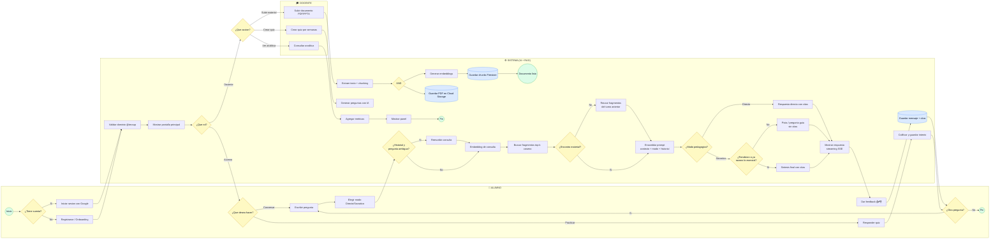

# Proceso de negocio — ProfeTEC.IA (BPMN)

```mermaid
flowchart LR
    %% ===================== ALUMNO =====================
    subgraph AL["🧑 ALUMNO"]
        I((Inicio)) --> Q1{¿Tiene cuenta?}
        Q1 -->|Si| LOGIN[Iniciar sesion con Google]
        Q1 -->|No| REG[Registrarse / Onboarding]
        QDES{¿Que desea hacer?}
        PREG[Escribir pregunta]
        MODOSEL[Elegir modo Directo/Socratico]
        RESPQUIZ[Responder quiz]
        FB[Dar feedback 👍/👎]
        Q5{¿Otra pregunta?}
        FIN((Fin))
    end

    %% ===================== DOCENTE =====================
    subgraph DOC["🎓 DOCENTE"]
        SUB[Subir documento PDF/PPTX]
        CQ[Crear quiz por semanas]
        ANA[Consultar analitica]
    end

    %% ===================== SISTEMA =====================
    subgraph SIS["⚙️ SISTEMA (IA + RAG)"]
        VAL[Validar dominio @tecsup]
        HOME[Mostrar pantalla principal]
        ROL{¿Que rol?}

        %% Ingesta
        CHUNK[Extraer texto + chunking]
        AND{AND}
        EMB1[Generar embeddings]
        SAVEC[(Guardar chunks Firestore)]
        SAVEG[(Guardar PDF en Cloud Storage)]
        DOCOK((Documento listo))

        %% Chat RAG
        Q2{¿Historial y\npregunta ambigua?}
        REW[Reescribir consulta]
        EMB2[Embedding de consulta]
        BUS[Buscar fragmentos top-k coseno]
        Q3{¿Encontro material?}
        REUSE[Reusar fragmentos\ndel turno anterior]
        ENS[Ensamblar prompt\ncontexto + modo + historial]
        MODO{¿Modo pedagogico?}
        DIR[Respuesta directa con citas]
        SOC{¿Rendicion o ya\nrazono lo esencial?}
        GUIA[Pista / pregunta guia\nsin citas]
        SINT[Sintesis final con citas]
        SHOW[Mostrar respuesta\nstreaming SSE]
        SAVEM[(Guardar mensaje + citas)]

        %% Quiz
        QGEN[Generar preguntas con IA]
        CALIF[Calificar y guardar intento]

        %% Analitica
        METRIC[Agregar metricas]
        PANEL[Mostrar panel]
        FINDOC((Fin))
    end

    %% ---------- Autenticacion ----------
    LOGIN --> VAL
    REG --> VAL
    VAL --> HOME --> ROL
    ROL -->|Docente| RDOC{¿Que accion?}
    ROL -->|Alumno| QDES

    %% ---------- Docente: acciones ----------
    RDOC -->|Subir material| SUB
    RDOC -->|Crear quiz| CQ
    RDOC -->|Ver analitica| ANA

    %% ---------- Ingesta ----------
    SUB --> CHUNK --> AND
    AND --> EMB1 --> SAVEC --> DOCOK
    AND --> SAVEG

    %% ---------- Quiz (docente genera) ----------
    CQ --> QGEN

    %% ---------- Analitica ----------
    ANA --> METRIC --> PANEL --> FINDOC

    %% ---------- Alumno elige actividad ----------
    QDES -->|Conversar| PREG
    QDES -->|Practicar| RESPQUIZ

    %% ---------- Chat RAG ----------
    PREG --> MODOSEL --> Q2
    Q2 -->|Si| REW --> EMB2
    Q2 -->|No| EMB2
    EMB2 --> BUS --> Q3
    Q3 -->|No| REUSE --> ENS
    Q3 -->|Si| ENS
    ENS --> MODO
    MODO -->|Directo| DIR --> SHOW
    MODO -->|Socratico| SOC
    SOC -->|No| GUIA --> SHOW
    SOC -->|Si| SINT --> SHOW
    SHOW --> FB --> SAVEM --> Q5
    Q5 -->|Si| PREG
    Q5 -->|No| FIN

    %% ---------- Quiz (alumno responde) ----------
    RESPQUIZ --> CALIF --> Q5

    %% ===================== ESTILOS =====================
    classDef store fill:#dbeafe,stroke:#3b82f6,color:#0f172a;
    classDef gate fill:#fef9c3,stroke:#ca8a04,color:#0f172a;
    classDef ev fill:#dcfce7,stroke:#16a34a,color:#0f172a;
    class SAVEC,SAVEG,SAVEM store;
    class Q1,QDES,Q2,Q3,Q5,ROL,RDOC,MODO,SOC,AND gate;
    class I,FIN,DOCOK,FINDOC ev;
```