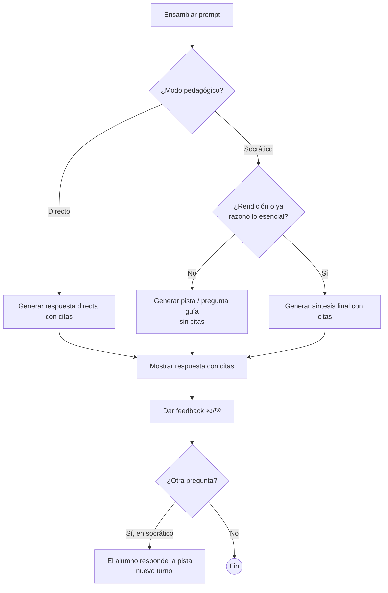
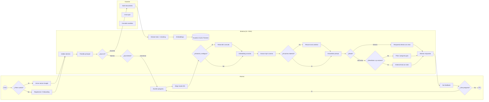
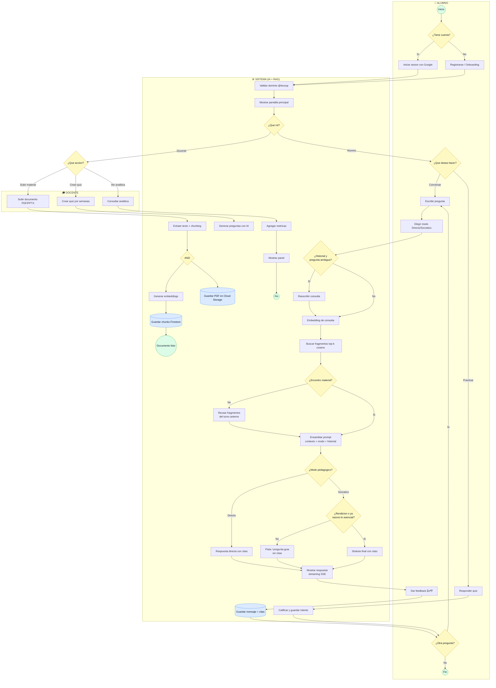

# Proceso de negocio — ProfeTEC.IA (BPMN)

Guía para reconstruir el diagrama BPMN en Bizagi, alineado con el sistema
realmente implementado: tutor de **chat conversacional RAG** sobre documentos del
curso, con modos Directo/Socrático, quizzes y panel de analítica para el docente.

> Reemplaza al diagrama antiguo basado en "ejercicios", que describía un producto
> distinto y tenía las salidas de autenticación invertidas.

## Estructura

**Pool:** `Proceso de ProfeTEC.IA`
**Carriles (lanes):**
1. **Docente**
2. **Alumno**
3. **Sistema (IA + RAG)**

Tipos de elemento: *evento* (inicio/fin), *tarea usuario* (acción de persona),
*tarea servicio* (acción automática del sistema), *compuerta XOR* (decisión
exclusiva), *compuerta AND* (paralelo).

---

## A) Autenticación

| Elemento | Tipo | Carril |
|---|---|---|
| Inicio | Evento inicio | Alumno |
| ¿Tiene cuenta? | Compuerta XOR | Alumno |
| Iniciar sesión con Google | Tarea usuario | Alumno |
| Registrarse (Onboarding) | Tarea usuario | Alumno |
| Validar dominio @tecsup.edu.pe | Tarea servicio | Sistema |
| Mostrar pantalla principal | Tarea servicio | Sistema |

**Flujos:**
- Inicio → ¿Tiene cuenta?
- ¿Tiene cuenta? → **Sí** → Iniciar sesión con Google
- ¿Tiene cuenta? → **No** → Registrarse (Onboarding)
- Ambas → Validar dominio @tecsup.edu.pe → Mostrar pantalla principal → ¿Qué rol?

> Nota: el login real es Google OAuth con dominio restringido (Firebase Auth),
> no un "crear cuenta / iniciar sesión" con usuario y contraseña.

---

## B) Ingesta de documentos (Docente)

| Elemento | Tipo | Carril |
|---|---|---|
| ¿Qué rol? | Compuerta XOR | Sistema |
| Subir documento (PDF/PPTX) | Tarea usuario | Docente |
| Extraer texto + Chunking por páginas | Tarea servicio | Sistema |
| Generar embeddings (text-embedding-004) | Tarea servicio | Sistema |
| Guardar chunks en Firestore | Tarea servicio | Sistema |
| Guardar PDF original en Cloud Storage | Tarea servicio | Sistema |
| Documento listo para consultas | Evento fin | Sistema |

**Flujos:**
- ¿Qué rol? → **Docente** → Subir documento
- Subir documento → Extraer texto + Chunking → **(compuerta AND)**
- AND → Generar embeddings → Guardar chunks en Firestore → Documento listo
- AND → Guardar PDF original en Cloud Storage

---

## C) Conversación / Chat RAG (Alumno) — núcleo del sistema

| Elemento | Tipo | Carril |
|---|---|---|
| ¿Qué desea hacer? | Compuerta XOR | Alumno |
| Escribir pregunta | Tarea usuario | Alumno |
| Elegir modo (Directo / Socrático) | Tarea usuario | Alumno |
| ¿Hay historial y pregunta ambigua? | Compuerta XOR | Sistema |
| Reescribir consulta con historial | Tarea servicio | Sistema |
| Generar embedding de la consulta | Tarea servicio | Sistema |
| Buscar fragmentos relevantes (top-k, coseno) | Tarea servicio | Sistema |
| ¿Encontró material? | Compuerta XOR | Sistema |
| Reusar fragmentos del turno anterior | Tarea servicio | Sistema |
| Ensamblar prompt (contexto + modo + historial) | Tarea servicio | Sistema |
| Generar respuesta con Gemini 2.5 Flash | Tarea servicio | Sistema |
| Mostrar respuesta con citas (streaming) | Tarea servicio | Sistema |
| Dar feedback 👍/👎 | Tarea usuario | Alumno |
| Guardar mensaje y citas en Firestore | Tarea servicio | Sistema |
| ¿Otra pregunta? | Compuerta XOR | Alumno |
| Fin conversación | Evento fin | Alumno |

**Flujos:**
- ¿Qué rol? → **Alumno** → ¿Qué desea hacer? → **Conversar** → Escribir pregunta
- Escribir pregunta → Elegir modo → ¿Hay historial y pregunta ambigua?
- ¿Hay historial...? → **Sí** → Reescribir consulta → Generar embedding
- ¿Hay historial...? → **No** → Generar embedding *(salta la reescritura)*
- Generar embedding → Buscar fragmentos relevantes → ¿Encontró material?
- ¿Encontró material? → **No (y hay historial)** → Reusar fragmentos del turno anterior → Ensamblar prompt
- ¿Encontró material? → **Sí** → Ensamblar prompt
- Ensamblar prompt → Generar respuesta con Gemini → Mostrar respuesta con citas → Dar feedback
- Dar feedback → Guardar mensaje y citas → ¿Otra pregunta?
- ¿Otra pregunta? → **Sí** → Escribir pregunta *(bucle)*
- ¿Otra pregunta? → **No** → Fin conversación

> Detalles que el ensamblaje del prompt aplica internamente:
> - **Modo pedagógico**: Directo (responde) vs Socrático (guía con preguntas).
> - **Flag rendición**: si el alumno dice "no lo sé"/"ayúdame" en modo socrático,
>   se fuerza la síntesis final.
> - **Flag contexto débil**: si el mejor score de similitud es bajo, se avisa al
>   modelo para que no complete con conocimiento externo.

---

## C.1) Bifurcación por modo pedagógico (Directo vs Socrático)

Tras *Ensamblar prompt*, la tarea *Generar respuesta con Gemini* se comporta
distinto según el modo que eligió el alumno. Esto se controla con dos
`system_instruction` diferentes (no son dos modelos distintos), pero a nivel de
proceso conviene representarlo como una compuerta.

| Elemento | Tipo | Carril |
|---|---|---|
| ¿Modo pedagógico? | Compuerta XOR | Sistema |
| Generar respuesta directa con citas | Tarea servicio | Sistema |
| ¿Rendición o ya razonó lo esencial? | Compuerta XOR | Sistema |
| Generar síntesis final con citas | Tarea servicio | Sistema |
| Generar pista / pregunta guía (sin citas) | Tarea servicio | Sistema |

**Flujos:**
- Ensamblar prompt → ¿Modo pedagógico?
- ¿Modo pedagógico? → **Directo** → Generar respuesta directa con citas → Mostrar respuesta
- ¿Modo pedagógico? → **Socrático** → ¿Rendición o ya razonó lo esencial?
- ¿Rendición...? → **Sí** → Generar síntesis final con citas → Mostrar respuesta
- ¿Rendición...? → **No** → Generar pista / pregunta guía (sin citas) → Mostrar respuesta

### Cómo funciona cada modo

**Modo Directo** (`SYSTEM_PROMPT_DIRECTO`):
1. Responde de inmediato, sin saludo, empezando por la respuesta.
2. Usa únicamente el material recuperado y **cita siempre** la fuente `[📄 doc, pág. X]`.
3. Es de un solo turno: pregunta → respuesta completa.

**Modo Socrático** (`SYSTEM_PROMPT_SOCRATICO`):
1. **No** entrega la solución de entrada: arranca con una pista breve o una
   pregunta guía basada en el material.
2. Avanza en pasos pequeños; según lo que responde el alumno ajusta la siguiente
   pista (máximo 2-3 preguntas por turno).
3. Reconoce los aciertos previos y no repite preguntas ya contestadas
   (usa la memoria conversacional).
4. **Cita solo** cuando afirma contenido del material o da la síntesis final;
   no cita cuando su turno es solo una pregunta guía.
5. **Condición de salida** → da la síntesis final con cita cuando:
   - el alumno ya razonó lo esencial, **o**
   - pide explícitamente la respuesta / se rinde ("no lo sé", "ayúdame"), **o**
   - lleva varios intentos sin avanzar.

> Es decir: el modo Directo termina en un turno; el Socrático es un **bucle de
> guía** (pista → respuesta del alumno → siguiente pista) que se cierra con la
> síntesis cuando se cumple la condición de salida.

### Diagrama del modo (Mermaid)

---

## D) Quizzes

| Elemento | Tipo | Carril |
|---|---|---|
| Crear quiz (rango de semanas) | Tarea usuario | Docente |
| Generar preguntas con IA desde el material | Tarea servicio | Sistema |
| Responder quiz | Tarea usuario | Alumno |
| Calificar y guardar intento | Tarea servicio | Sistema |

**Flujos:**
- ¿Qué desea hacer? → **Practicar** → Responder quiz → Calificar y guardar intento → ¿Otra actividad?
- (Lado docente) Crear quiz → Generar preguntas con IA → *(quiz disponible para alumnos)*

---

## E) Analítica del docente

| Elemento | Tipo | Carril |
|---|---|---|
| Consultar analítica del curso | Tarea usuario | Docente |
| Agregar métricas (mensajes, feedback, aciertos) | Tarea servicio | Sistema |
| Mostrar panel | Tarea servicio | Sistema |

**Flujos:**
- ¿Qué rol? → **Docente** → Consultar analítica → Agregar métricas → Mostrar panel → Fin

---

## Diagrama de referencia (Mermaid)

## Diagrama completo (Mermaid) — todo el proceso

Integra los 5 sub-flujos en un solo diagrama con los tres carriles.

---

## Diferencias clave vs. el BPMN anterior

| Aspecto | BPMN antiguo | Sistema real (este documento) |
|---|---|---|
| Autenticación | Salidas Si/No invertidas | Google OAuth + dominio restringido |
| Actor Docente | Ausente | Sube docs, crea quizzes, ve analítica |
| Modelo de tutoría | "Ejercicios" (generar/corregir/resolver) | Chat RAG con citas del material |
| Modos pedagógicos | No existían | Directo y Socrático |
| Pipeline RAG | Ausente | Ingesta → embeddings → búsqueda → Gemini |
| Reescritura de consulta | — | Contextualiza seguimientos cortos |
| Feedback | — | 👍/👎 por respuesta |
| "Guardar en Memoria de IA" | Paso final difuso | Mensajes en Firestore + memoria de turnos |
